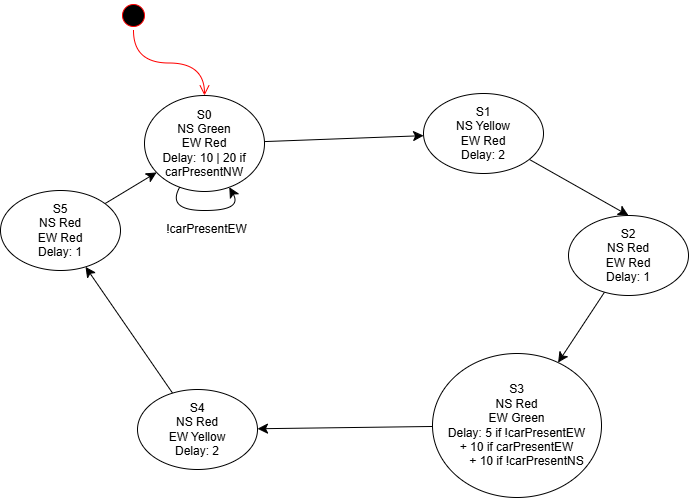

# traffic_light

## Prompt:
```
Please write and check into a public facing repo:
1. gcc-compatible C code and makele for implementing the state machine of a trafc light with
appropriately timed outputs on the console
2. A test suite for the state machine 
```

## Project Design

This project aims to simulate a traffic light with four directions: north, east, south, and west. The states of the Finite State Machine (FSM) below are as follows: 
- **S0**: The default state is green in the NS directions and red in the EW directions. We remain in that state until a car approaches travelling east/west. If a car is travelling north/south still, the delay is 20 seconds; otherwise 10 seconds.
- **S1**: The yellow light has a 2 second delay.
- **S2**: All lights are red for 1 second for safety.
- **S3**: When the east/west light is green, the minimum delay is 5 seconds. If there is a car travelling east/west, we add a 10 second delay. If the previous is true and there is not a car travelling north/south, we add another 10 second delay.
- **S4**: The yellow light has a 2 second delay.
- **S5**: All lights are red for 1 second for safety.



## How to build

See `Makefile` for the build scripts.

To build the project, simply run `make`
at the command line in the current directory.

By default, this will generate an executable called whatever `PNAME`
is bound to in `Makefile` (by default, `traffic_light`).

## How to run
To then run the program, run

```
bin/traffic_light
```

in the project directory. 

Answer `y` for yes or `n` for no to indicate if a car is travelling North/South, or a car is travelling East/West. The stop light will delay an appropriate amount of time, then change state based on the input.

To compile and run the test suite, run `make test`.

## About the test framework

The unit testing framework is defined in `acutest.h`. See the source
for more links to more information.

The file `test_suite.c` has an example of the testing framework in action.

`make test` will run the tests in the file. 